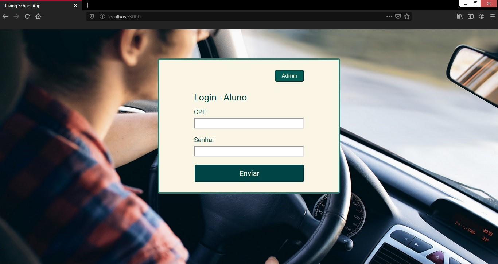
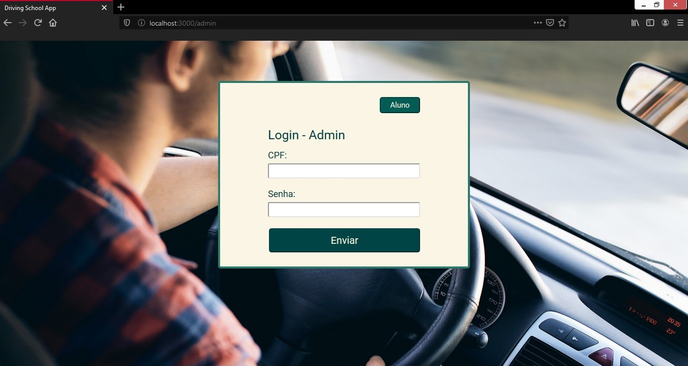
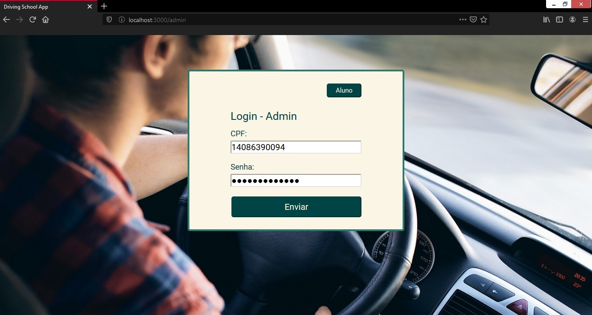
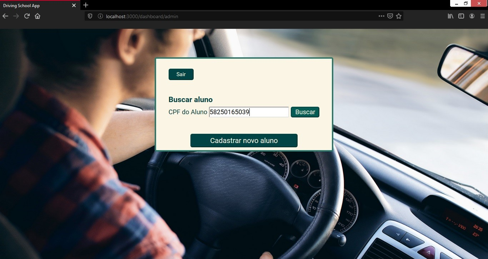
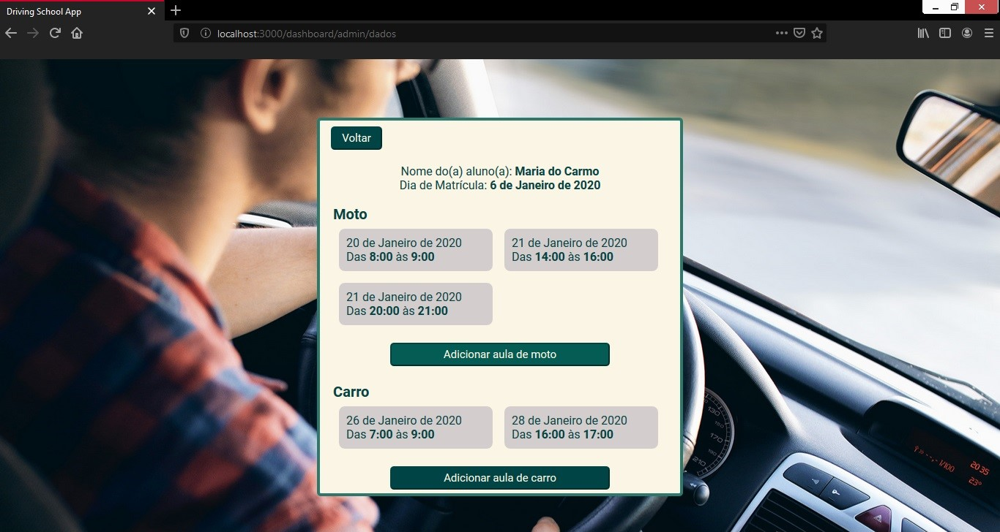
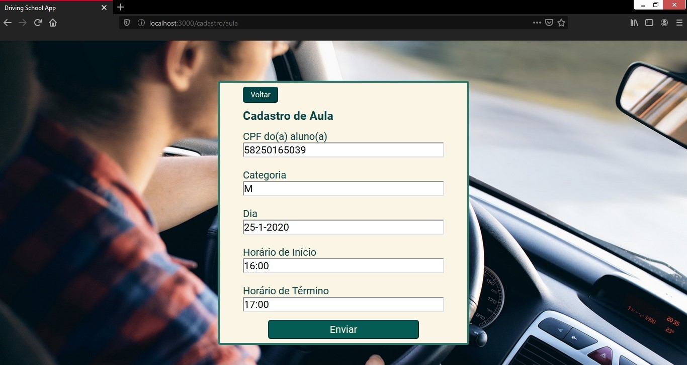
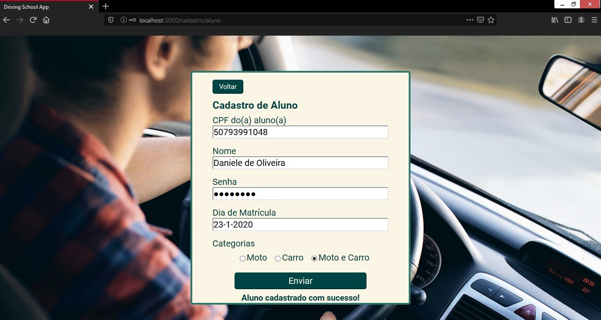
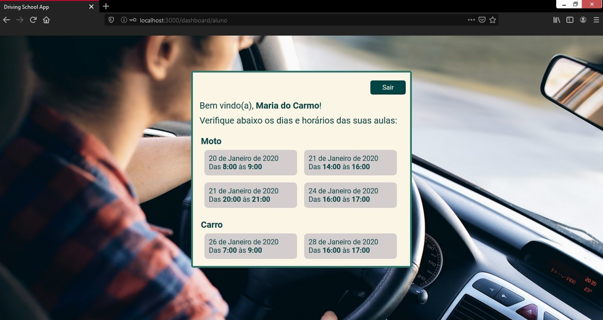

# driving-school-app #

A simplified driving school app using React on the frontend and Nodejs, Express and MongoDB Atlas on the backend.


## Usage ##
* Post new users directly on route '/users' of localhost:3333. The User schema has the follow structure:
```javascript
{
    nome: String,
    diaDeMatricula: Date,
    admin: true,
    cpf: String,
    senha: String,
    moto: Boolean,
    carro: Boolean,
}
```
* Create a “.env” file in /backend directory, following the structure of “.env.default” file
* In a terminal, use “npm start” (for both /backend and /frontend directories)

## App preview ##


## Routes Screenshots ##

Route '/'


Route '/admin'


Route '/admin' filled


Route '/dashboard/admin'


Route '/dashboard/admin/dados'


Route '/cadastro/aula'


Route '/cadastro/aula' success


Route '/cadastro/aluno' success


Route '/dashboard/aluno' success

